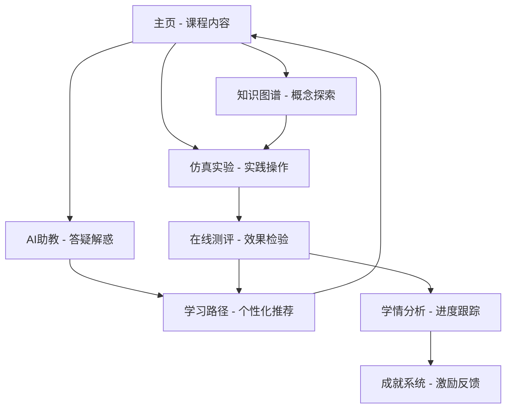

# 芯智育才平台PRD与TODO综合规划

## 1. 产品概述

芯智育才是一个基于AI大模型技术的智能化8051微控制器课程教学辅助平台，采用Next.js 15、TypeScript、Prisma等现代化技术栈构建。平台通过深度融合人工智能于学习的每一个环节，为学生打造沉浸式、高效率、充满趣味的在线学习环境，致力于解决传统教学模式中理论与实践脱节、缺乏个性化辅导等核心痛点。

该平台不仅是知识展示工具，更是能与学生实时互动、洞察学习状态并提供定制化辅导的"智能学习伙伴"，通过多模态交互、即时仿真反馈、数据驱动的学情分析和游戏化激励机制，助力未来卓越工程师的培养。

## 2. 核心功能

### 2.1 用户角色

| 角色 | 注册方式 | 核心权限 |
|------|----------|----------|
| 学生 (STUDENT) | 邮箱注册，包含学号、班级、年级、专业信息 | 访问所有学习功能、参与测验、获得成就、查看学情分析 |
| 教师 (TEACHER) | 邮箱注册，包含教工号、部门、职称信息 | 查看学生进度、管理课程内容、评分反馈 |
| 管理员 (ADMIN) | 系统分配 | 用户管理、系统配置、数据分析 |
| 访客 (GUEST) | 无需注册 | 浏览基础内容、体验部分功能 |

### 2.2 功能模块

平台包含以下核心页面和功能模块：

1. **主页**：课程内容展示、章节导航、学习目标展示、代码示例
2. **AI智能助教**：7x24小时在线答疑、多模态解答、学习推荐、代码生成
3. **代码仿真实验**：AI驱动的8051汇编代码仿真、故障注入、可视化反馈
4. **可视化知识图谱**：交互式知识网络、概念关联展示、探索式学习
5. **在线测评系统**：即时诊断反馈、自适应题目推荐、学习路径规划
6. **学情分析仪表盘**：个性化数据展示、能力评估、进度跟踪
7. **成就系统**：游戏化激励、徽章收集、进度展示

### 2.3 页面详情

| 页面名称 | 模块名称 | 功能描述 |
|----------|----------|----------|
| 主页 (/) | 课程内容展示 | 展示9个章节的详细内容，包含学习目标、知识点梳理、代码示例、思政融合点 |
| 主页 (/) | 章节导航 | 可折叠的手风琴式章节导航，支持关键词搜索和快速定位 |
| 主页 (/) | 代码示例展示 | 提供可复制的8051汇编代码示例，支持语法高亮显示 |
| AI助教 (/ai-assistant) | 智能问答 | 基于DeepSeek/Google AI的自然语言问答，支持课程相关问题解答 |
| AI助教 (/ai-assistant) | 多模态回答 | 提供文字解答、代码示例、相关视频推荐、章节链接 |
| AI助教 (/ai-assistant) | 对话历史 | 保存和展示用户与AI的对话记录，支持上下文理解 |
| 仿真实验 (/simulation) | 代码编辑器 | 支持8051汇编代码编写，提供语法高亮和基础代码补全 |
| 仿真实验 (/simulation) | AI仿真引擎 | 基于AI的代码执行仿真，分析寄存器状态、端口值变化 |
| 仿真实验 (/simulation) | 故障注入系统 | 模拟硬件故障（如引脚短路、晶振故障），分析故障影响 |
| 仿真实验 (/simulation) | 可视化显示 | LED状态显示、七段数码管显示、波形图展示、寄存器监控 |
| 仿真实验 (/simulation) | 实验模板 | 预设多个实验案例，包含LED控制、定时器应用、中断处理等 |
| 知识图谱 (/knowledge-graph) | 交互式图谱 | 基于D3.js的可视化知识网络，展示概念间关联关系 |
| 知识图谱 (/knowledge-graph) | 节点详情 | 点击节点查看详细定义、相关章节、应用实例 |
| 知识图谱 (/knowledge-graph) | 章节筛选 | 按章节高亮显示相关知识点，支持探索式学习 |
| 在线测评 (/quiz) | 题目展示 | 支持单选、多选、判断等题型，提供即时反馈 |
| 在线测评 (/quiz) | 智能评分 | 自动评分并生成详细解析，指向相关复习章节 |
| 在线测评 (/quiz) | 学习诊断 | 基于答题情况分析薄弱知识点，生成学习建议 |
| 学情分析 (/analytics) | 数据仪表盘 | 展示总学分、知识掌握度、成就进度等关键指标 |
| 学情分析 (/analytics) | 能力雷达图 | 基于布鲁姆认知层级的多维能力评估可视化 |
| 学情分析 (/analytics) | 学习热力图 | 知识点掌握度的热力图展示，直观显示学习盲区 |
| 学情分析 (/analytics) | 进度跟踪 | 学习时长、完成度、活跃度等数据的时间序列分析 |
| 成就系统 (/achievements) | 成就展示 | 25+个精美设计的成就徽章，按类别组织展示 |
| 成就系统 (/achievements) | 进度追踪 | 实时更新成就解锁进度，提供激励反馈 |
| 成就系统 (/achievements) | 成就筛选 | 支持按类别、状态筛选成就，便于用户查看 |

## 3. 核心流程

### 3.1 学生学习流程

学生进入平台后，首先在主页浏览课程内容，通过章节导航定位感兴趣的知识点。遇到疑问时，可前往AI助教页面提问，获得多模态的详细解答。为加深理解，学生进入仿真实验页面，编写和运行8051汇编代码，通过可视化反馈观察程序执行效果。通过知识图谱页面探索概念间的关联关系，构建系统性认知。完成学习后，参与在线测评检验学习效果，系统根据答题情况生成个性化学习建议。整个过程中，学生可在学情分析页面查看学习进度，在成就系统中获得激励反馈。

### 3.2 教师教学流程

教师通过管理后台查看学生的学习进度和测评结果，识别班级整体的薄弱环节。利用平台提供的AI辅助备课功能，快速生成教学内容和测验题目。在课堂教学中，可使用仿真实验功能进行实时演示，通过故障注入功能训练学生的调试能力。课后通过学情分析功能跟踪学生学习效果，为个别学生提供针对性指导。



## 4. 用户界面设计

### 4.1 设计风格

- **主色调**：蓝色系 (#3B82F6) 作为主色，传达科技感和专业性
- **辅助色**：绿色 (#10B981) 表示成功状态，红色 (#EF4444) 表示错误状态，黄色 (#F59E0B) 表示警告
- **按钮样式**：圆角矩形设计，支持多种尺寸和状态变化，具有悬停和点击效果
- **字体**：系统默认字体栈，中文优先使用苹方、微软雅黑，英文使用Inter、Roboto
- **布局风格**：卡片式设计，采用栅格系统，响应式布局适配多种屏幕尺寸
- **图标风格**：使用Lucide React图标库，线性风格，保持视觉一致性

### 4.2 页面设计概览

| 页面名称 | 模块名称 | UI元素 |
|----------|----------|--------|
| 主页 | 课程内容展示 | 手风琴式折叠面板，支持搜索过滤，代码块语法高亮，复制按钮交互 |
| 主页 | 章节目标卡片 | 三栏布局：知识点目标、技能目标、思政融合点，使用不同背景色区分 |
| 主页 | 核心知识梳理 | 四象限卡片布局：重点、难点、易错点、考点，配色区分重要性 |
| AI助教 | 对话界面 | 聊天气泡式设计，用户消息右对齐，AI回复左对齐，支持Markdown渲染 |
| AI助教 | 输入区域 | 底部固定输入框，支持多行文本，发送按钮状态响应 |
| 仿真实验 | 代码编辑器 | Monaco Editor集成，语法高亮，行号显示，代码折叠功能 |
| 仿真实验 | 控制面板 | 运行、停止、重置按钮，故障注入下拉选择，实验模板选择器 |
| 仿真实验 | 结果展示 | 多标签页布局：寄存器视图、端口状态、LED显示、波形图表 |
| 知识图谱 | 图谱画布 | 全屏D3.js可视化，节点拖拽交互，缩放平移支持，悬停提示 |
| 知识图谱 | 控制面板 | 侧边栏章节筛选器，搜索框，图例说明，布局算法选择 |
| 测评系统 | 题目展示 | 卡片式题目布局，选项按钮组，进度条显示，计时器组件 |
| 测评系统 | 结果反馈 | 即时正误提示，详细解析展开，相关章节链接，下一题按钮 |
| 学情分析 | 数据仪表盘 | 网格布局的统计卡片，数值动画效果，图表组件集成 |
| 学情分析 | 可视化图表 | Recharts雷达图、热力图、折线图，交互式图例，数据钻取 |
| 成就系统 | 成就网格 | 响应式网格布局，成就卡片悬停效果，进度环形图，筛选标签 |
| 成就系统 | 详情弹窗 | 模态对话框，成就大图展示，获得条件说明，分享功能 |

### 4.3 响应式设计

平台采用移动优先的响应式设计策略，支持桌面端、平板端和移动端的完美适配。在移动端优化了触摸交互体验，调整了按钮尺寸和间距，简化了复杂的交互流程。代码编辑器在移动端提供了专门的触摸键盘，知识图谱支持手势缩放和拖拽操作。

## 5. 当前项目状态评估

### 5.1 功能完成度

**整体完成度：85%**

- ✅ **首页学习内容**：完成度 90% - 内容丰富，交互完善
- ✅ **AI智能助教**：完成度 80% - 界面完整，AI集成待优化
- ✅ **代码仿真实验**：完成度 85% - 专业IDE界面，仿真精度待提升
- ✅ **知识图谱**：完成度 75% - 基础功能完整，数据丰富度待提升
- ✅ **智能测评**：完成度 85% - 功能完整，题库内容待扩充
- ✅ **学情分析**：完成度 80% - 基础分析完整，算法待优化
- ✅ **成就系统**：完成度 80% - 界面完整，触发逻辑待完善

### 5.2 技术架构现状

**优势**：
- 现代化技术栈：Next.js 15 + React 18 + TypeScript + Prisma
- 功能完整性：教学、仿真、测验、分析等核心功能齐全
- 安全基础：认证中间件、错误边界、安全头配置已实现
- 性能优化基础：部分组件已使用 React.memo，具备缓存机制

**关键问题**：
- 组件职责过重（simulation/page.tsx 达到 809 行）
- 状态管理混乱（Zustand + Context API + 本地状态）
- 类型安全问题（约 160 个 TypeScript 错误）
- 性能瓶颈（Hook 绑定多个全局监听器）
- 内存泄漏风险（数据数组无限增长）

### 5.3 已修复问题

基于实验仿真平台检测执行记录，以下问题已得到修复：
- ✅ 实验分级错误修复
- ✅ 学习时间计时过快修复
- ✅ 单步调试无效修复
- ✅ PC地址错误修复
- ✅ 实验内容不一致修复

## 6. TODO清单与优化计划

### 6.1 第一阶段：紧急修复（1-2周）

#### 高优先级 (P0)

- [ ] **TypeScript 错误修复**
  - [ ] 统一接口定义（解决 `averageScore` vs `avgScore` 不一致）
  - [ ] 完善类型声明文件
  - [ ] 修复组件 props 类型错误
  - [ ] 添加缺失的类型导入
  - **验收标准**：`npm run type-check` 无错误

- [ ] **超大组件拆分**
  - [ ] 拆分 `src/app/simulation/page.tsx` (809行)：
    - [ ] `SimulationContainer.tsx` - 主容器
    - [ ] `CodeEditor.tsx` - 代码编辑器
    - [ ] `PeripheralPanel.tsx` - 外设面板
    - [ ] `ControlPanel.tsx` - 控制面板
    - [ ] `ExperimentSelector.tsx` - 实验选择器
  - **验收标准**：单个组件文件不超过 300 行

- [ ] **性能瓶颈 Hook 优化**
  - [ ] 优化 `useTrackProgress` 等重型 Hook
  - [ ] 添加防抖机制
  - [ ] 优化事件监听器管理
  - [ ] 添加 AbortController 统一管理
  - **验收标准**：内存使用量减少 30%

#### 中优先级 (P1)

- [ ] **AI功能优化**
  - [ ] 提升AI回答的8051专业性和准确性
  - [ ] 完善错误处理和降级策略
  - [ ] 优化代码生成和错误诊断功能
  - [ ] 增强学习路径推荐的个性化程度

- [ ] **仿真精度提升**
  - [ ] 完善8051指令集支持
  - [ ] 优化仿真算法准确性
  - [ ] 增强波形图和LED显示的交互性
  - [ ] 丰富实验模板内容

### 6.2 第二阶段：架构优化（2-3周）

#### 高优先级 (P1)

- [ ] **统一状态管理**
  - [ ] 建立清晰的状态管理架构
  - [ ] **Zustand**：主要业务状态（用户数据、学习进度、实验状态）
  - [ ] **Context API**：全局配置（主题、认证、语言）
  - [ ] **本地状态**：仅用于组件内部 UI 状态
  - [ ] 添加状态持久化策略

- [ ] **数据库性能优化**
  - [ ] 添加关键索引：
    ```sql
    CREATE INDEX idx_user_progress_user_id ON UserProgress(userId);
    CREATE INDEX idx_quiz_history_user_id ON QuizHistory(userId);
    CREATE INDEX idx_learning_progress_user_id ON LearningProgress(userId);
    CREATE INDEX idx_user_activity_user_id_created ON UserActivity(userId, createdAt);
    ```
  - [ ] 实施查询性能监控
  - [ ] 添加数据库连接池
  - [ ] 优化 N+1 查询问题

#### 中优先级 (P2)

- [ ] **缓存策略实施**
  - [ ] 浏览器缓存：静态资源、API 响应
  - [ ] 服务端缓存：数据库查询结果
  - [ ] CDN 缓存：图片、视频等媒体资源
  - [ ] 集成 React Query 或 SWR 用于客户端缓存

- [ ] **内容质量提升**
  - [ ] 扩充题库内容数量和质量
  - [ ] 完善知识图谱数据和关联关系
  - [ ] 丰富节点详情展示内容
  - [ ] 优化成就触发逻辑和条件

### 6.3 第三阶段：质量提升（1-2周）

#### 中优先级 (P2)

- [ ] **错误处理完善**
  - [ ] 统一错误类型定义
  - [ ] 添加用户友好的错误提示
  - [ ] 实施错误监控和报告
  - [ ] 完善错误边界覆盖

- [ ] **测试覆盖建立**
  - [ ] **单元测试**：核心业务逻辑、工具函数
  - [ ] **集成测试**：API 路由、数据库操作
  - [ ] **E2E 测试**：关键用户流程
  - [ ] 使用 Jest + Testing Library（单元测试）
  - [ ] 使用 Playwright（E2E 测试）

#### 低优先级 (P3)

- [ ] **性能监控完善**
  - [ ] 页面加载时间监控
  - [ ] API 响应时间监控
  - [ ] 数据库查询性能监控
  - [ ] 内存使用情况监控
  - [ ] 错误率统计

- [ ] **用户体验优化**
  - [ ] 更细致的微交互设计
  - [ ] 无障碍访问支持
  - [ ] 深色模式适配
  - [ ] 移动端触摸交互优化

### 6.4 第四阶段：功能扩展（1-2个月）

#### 低优先级 (P3)

- [ ] **社交功能**
  - [ ] 学习分享和协作功能
  - [ ] 成就社交分享功能
  - [ ] 学习小组和讨论区
  - [ ] 积分兑换系统

- [ ] **高级功能**
  - [ ] 支持更多微控制器型号（STM32、Arduino等）
  - [ ] 增加虚拟实验室功能
  - [ ] 开发移动端原生应用
  - [ ] 集成VR/AR技术增强沉浸感

- [ ] **AI能力提升**
  - [ ] 更智能的代码自动生成
  - [ ] 基于学习行为的智能推荐
  - [ ] 多语言支持和国际化
  - [ ] 语音交互和图像识别

## 7. 预期收益

### 7.1 性能提升
- 页面加载速度提升 30-50%
- API 响应时间减少 40%
- 内存使用优化 30%

### 7.2 开发效率
- 新功能开发效率提升 40%
- Bug 修复时间减少 50%
- 代码审查效率提升 60%

### 7.3 系统稳定性
- 错误率降低 80%
- 系统可用性提升至 99.5%
- 用户体验满意度提升 35%

## 8. 实施建议

### 8.1 资源分配
- **开发人员**：1-2 名全职开发者
- **时间投入**：每周 20-30 小时
- **优先级**：按阶段顺序执行，不可跳跃

### 8.2 风险控制
- 每个阶段完成后进行全面测试
- 保持功能向后兼容
- 建立回滚机制
- 定期备份数据和代码

### 8.3 进度跟踪
- 每周进度评估
- 关键节点里程碑检查
- 问题及时上报和解决
- 文档同步更新

## 9. 成功标准

### 9.1 功能完整性标准
- 所有核心功能模块实现率 ≥ 95%
- 用户核心流程完整可用
- AI功能响应准确率 ≥ 85%
- 系统稳定性 ≥ 99%

### 9.2 用户体验标准
- 页面加载时间 ≤ 3秒
- 移动端适配完整性 ≥ 90%
- 用户界面一致性评分 ≥ 8/10
- 可访问性合规率 ≥ 80%

### 9.3 技术质量标准
- 代码覆盖率 ≥ 70%
- 安全漏洞数量 = 0（高危）
- 性能评分 ≥ 85/100
- 部署成功率 ≥ 95%

## 10. 总结

芯智育才平台作为一个AI驱动的智能化教育平台，已经具备了完整的功能架构和良好的技术基础。通过系统性的优化计划，平台将在代码质量、系统性能、用户体验等方面得到显著提升。

本PRD与TODO规划基于项目现状制定，采用渐进式改进策略，确保在提升代码质量和系统性能的同时，保持项目的稳定运行。通过四个阶段的系统性优化，项目将在架构合理性、代码可维护性和系统性能方面得到显著提升，最终成为微控制器课程教学的优秀解