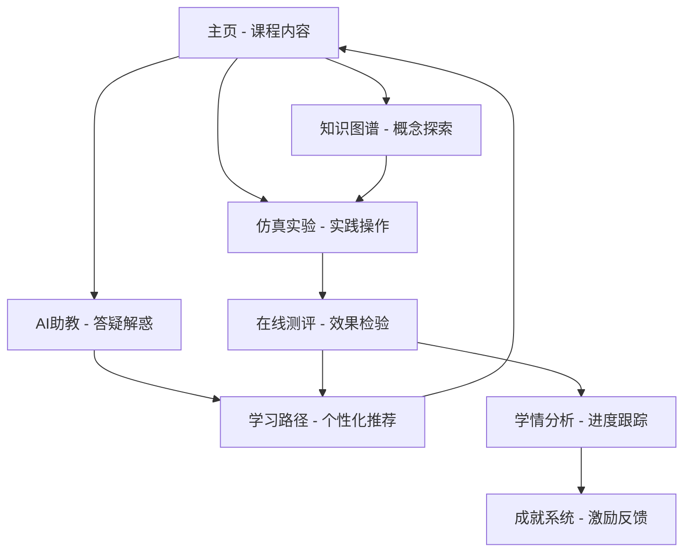

# 芯智育才 - 8051微控制器仿真教育平台逆向工程需求文档

## 1. 产品概述

"芯智育才"是一个基于AI大模型技术的智能化微控制器课程教学辅助平台，采用Next.js、Genkit等现代化技术栈构建。平台通过深度融合人工智能于学习的每一个环节，为学生打造沉浸式、高效率、充满趣味的在线学习环境，致力于解决传统教学模式中理论与实践脱节、缺乏个性化辅导等核心痛点。

该平台不仅是知识展示工具，更是能与学生实时互动、洞察学习状态并提供定制化辅导的"智能学习伙伴"，通过多模态交互、即时仿真反馈、数据驱动的学情分析和游戏化激励机制，助力未来卓越工程师的培养。

## 2. 核心功能

### 2.1 用户角色

| 角色 | 注册方式 | 核心权限 |
|------|----------|----------|
| 学生 (STUDENT) | 邮箱注册，包含学号、班级、年级、专业信息 | 访问所有学习功能、参与测验、获得成就、查看学情分析 |
| 教师 (TEACHER) | 邮箱注册，包含教工号、部门、职称信息 | 查看学生进度、管理课程内容、评分反馈 |
| 管理员 (ADMIN) | 系统分配 | 用户管理、系统配置、数据分析 |
| 访客 (GUEST) | 无需注册 | 浏览基础内容、体验部分功能 |

### 2.2 功能模块

平台包含以下核心页面和功能模块：

1. **主页**：课程内容展示、章节导航、学习目标展示
2. **AI智能助教**：7x24小时在线答疑、多模态解答、学习推荐
3. **代码仿真实验**：AI驱动的8051汇编代码仿真、故障注入、可视化反馈
4. **可视化知识图谱**：交互式知识网络、概念关联展示、探索式学习
5. **在线测评系统**：即时诊断反馈、自适应题目推荐、学习路径规划
6. **学情分析仪表盘**：个性化数据展示、能力评估、进度跟踪
7. **成就系统**：游戏化激励、徽章收集、进度展示

### 2.3 页面详情

| 页面名称 | 模块名称 | 功能描述 |
|----------|----------|----------|
| 主页 (/) | 课程内容展示 | 展示9个章节的详细内容，包含学习目标、知识点梳理、代码示例、思政融合点 |
| 主页 (/) | 章节导航 | 可折叠的手风琴式章节导航，支持关键词搜索和快速定位 |
| 主页 (/) | 代码示例展示 | 提供可复制的8051汇编代码示例，支持语法高亮显示 |
| AI助教 (/ai-assistant) | 智能问答 | 基于DeepSeek/Google AI的自然语言问答，支持课程相关问题解答 |
| AI助教 (/ai-assistant) | 多模态回答 | 提供文字解答、代码示例、相关视频推荐、章节链接 |
| AI助教 (/ai-assistant) | 对话历史 | 保存和展示用户与AI的对话记录，支持上下文理解 |
| 仿真实验 (/simulation) | 代码编辑器 | 支持8051汇编代码编写，提供语法高亮和基础代码补全 |
| 仿真实验 (/simulation) | AI仿真引擎 | 基于AI的代码执行仿真，分析寄存器状态、端口值变化 |
| 仿真实验 (/simulation) | 故障注入系统 | 模拟硬件故障（如引脚短路、晶振故障），分析故障影响 |
| 仿真实验 (/simulation) | 可视化显示 | LED状态显示、七段数码管显示、波形图展示、寄存器监控 |
| 仿真实验 (/simulation) | 实验模板 | 预设多个实验案例，包含LED控制、定时器应用、中断处理等 |
| 知识图谱 (/knowledge-graph) | 交互式图谱 | 基于D3.js的可视化知识网络，展示概念间关联关系 |
| 知识图谱 (/knowledge-graph) | 节点详情 | 点击节点查看详细定义、相关章节、应用实例 |
| 知识图谱 (/knowledge-graph) | 章节筛选 | 按章节高亮显示相关知识点，支持探索式学习 |
| 在线测评 (/quiz) | 题目展示 | 支持单选、多选、判断等题型，提供即时反馈 |
| 在线测评 (/quiz) | 智能评分 | 自动评分并生成详细解析，指向相关复习章节 |
| 在线测评 (/quiz) | 学习诊断 | 基于答题情况分析薄弱知识点，生成学习建议 |
| 学情分析 (/analytics) | 数据仪表盘 | 展示总学分、知识掌握度、成就进度等关键指标 |
| 学情分析 (/analytics) | 能力雷达图 | 基于布鲁姆认知层级的多维能力评估可视化 |
| 学情分析 (/analytics) | 学习热力图 | 知识点掌握度的热力图展示，直观显示学习盲区 |
| 学情分析 (/analytics) | 进度跟踪 | 学习时长、完成度、活跃度等数据的时间序列分析 |
| 成就系统 (/achievements) | 成就展示 | 25+个精美设计的成就徽章，按类别组织展示 |
| 成就系统 (/achievements) | 进度追踪 | 实时更新成就解锁进度，提供激励反馈 |
| 成就系统 (/achievements) | 成就筛选 | 支持按类别、状态筛选成就，便于用户查看 |
| 学习路径 (/learning-path) | 个性化推荐 | AI生成的个性化学习计划，基于用户薄弱点定制 |
| 学习路径 (/learning-path) | 路径可视化 | 以流程图形式展示学习路径，清晰显示学习顺序 |
| 学习路径 (/learning-path) | 进度管理 | 跟踪学习路径完成情况，支持路径调整和优化 |
| 用户中心 (/profile) | 个人信息 | 用户基本信息管理、头像上传、密码修改 |
| 用户中心 (/profile) | 学习统计 | 个人学习数据汇总，包含学习时长、完成课程数等 |
| 用户中心 (/profile) | 积分系统 | 积分获取记录、消费历史、积分排行榜 |

## 3. 核心流程

### 3.1 学生学习流程

学生进入平台后，首先在主页浏览课程内容，通过章节导航定位感兴趣的知识点。遇到疑问时，可前往AI助教页面提问，获得多模态的详细解答。为加深理解，学生进入仿真实验页面，编写和运行8051汇编代码，通过可视化反馈观察程序执行效果。通过知识图谱页面探索概念间的关联关系，构建系统性认知。完成学习后，参与在线测评检验学习效果，系统根据答题情况生成个性化学习建议。整个过程中，学生可在学情分析页面查看学习进度，在成就系统中获得激励反馈。

### 3.2 教师教学流程

教师通过管理后台查看学生的学习进度和测评结果，识别班级整体的薄弱环节。利用平台提供的AI辅助备课功能，快速生成教学内容和测验题目。在课堂教学中，可使用仿真实验功能进行实时演示，通过故障注入功能训练学生的调试能力。课后通过学情分析功能跟踪学生学习效果，为个别学生提供针对性指导。

## 4. 用户界面设计

### 4.1 设计风格

- **主色调**：蓝色系 (#3B82F6) 作为主色，传达科技感和专业性
- **辅助色**：绿色 (#10B981) 表示成功状态，红色 (#EF4444) 表示错误状态，黄色 (#F59E0B) 表示警告
- **按钮样式**：圆角矩形设计，支持多种尺寸和状态变化，具有悬停和点击效果
- **字体**：系统默认字体栈，中文优先使用苹方、微软雅黑，英文使用Inter、Roboto
- **布局风格**：卡片式设计，采用栅格系统，响应式布局适配多种屏幕尺寸
- **图标风格**：使用Lucide React图标库，线性风格，保持视觉一致性

### 4.2 页面设计概览

| 页面名称 | 模块名称 | UI元素 |
|----------|----------|--------|
| 主页 | 课程内容展示 | 手风琴式折叠面板，支持搜索过滤，代码块语法高亮，复制按钮交互 |
| 主页 | 章节目标卡片 | 三栏布局：知识点目标、技能目标、思政融合点，使用不同背景色区分 |
| 主页 | 核心知识梳理 | 四象限卡片布局：重点、难点、易错点、考点，配色区分重要性 |
| AI助教 | 对话界面 | 聊天气泡式设计，用户消息右对齐，AI回复左对齐，支持Markdown渲染 |
| AI助教 | 输入区域 | 底部固定输入框，支持多行文本，发送按钮状态响应 |
| 仿真实验 | 代码编辑器 | Monaco Editor集成，语法高亮，行号显示，代码折叠功能 |
| 仿真实验 | 控制面板 | 运行、停止、重置按钮，故障注入下拉选择，实验模板选择器 |
| 仿真实验 | 结果展示 | 多标签页布局：寄存器视图、端口状态、LED显示、波形图表 |
| 知识图谱 | 图谱画布 | 全屏D3.js可视化，节点拖拽交互，缩放平移支持，悬停提示 |
| 知识图谱 | 控制面板 | 侧边栏章节筛选器，搜索框，图例说明，布局算法选择 |
| 测评系统 | 题目展示 | 卡片式题目布局，选项按钮组，进度条显示，计时器组件 |
| 测评系统 | 结果反馈 | 即时正误提示，详细解析展开，相关章节链接，下一题按钮 |
| 学情分析 | 数据仪表盘 | 网格布局的统计卡片，数值动画效果，图表组件集成 |
| 学情分析 | 可视化图表 | Recharts雷达图、热力图、折线图，交互式图例，数据钻取 |
| 成就系统 | 成就网格 | 响应式网格布局，成就卡片悬停效果，进度环形图，筛选标签 |
| 成就系统 | 详情弹窗 | 模态对话框，成就大图展示，获得条件说明，分享功能 |

### 4.3 响应式设计

平台采用移动优先的响应式设计策略，支持桌面端、平板端和移动端的完美适配。在移动端优化了触摸交互体验，调整了按钮尺寸和间距，简化了复杂的交互流程。代码编辑器在移动端提供了专门的触摸键盘，知识图谱支持手势缩放和拖拽操作。

## 5. 技术架构

### 5.1 前端技术栈
- **框架**：Next.js 15.3.3 (App Router)
- **UI库**：ShadCN/UI + Tailwind CSS
- **状态管理**：Zustand
- **图表库**：Recharts
- **图标库**：Lucide React
- **动画库**：Framer Motion
- **代码编辑器**：Monaco Editor
- **可视化**：D3.js

### 5.2 后端技术栈
- **数据库**：PostgreSQL + Prisma ORM
- **身份认证**：JWT + bcryptjs
- **AI集成**：Google AI Genkit + DeepSeek API
- **文件处理**：html2canvas + file-saver

### 5.3 AI功能实现
- **AI助教**：基于aiStudyAssistant Flow，支持多轮对话和上下文理解
- **代码仿真**：codeSimulationFlow实现AI驱动的8051汇编代码分析
- **学习推荐**：learningPlanFlow生成个性化学习路径
- **内容生成**：AI辅助生成课程内容、测验题目和学习建议

### 5.4 数据模型设计
- **用户系统**：User、Session、UserActivity模型
- **学习系统**：LearningPath、LearningProgress、UserExperiment模型
- **评估系统**：QuizAttempt、UserAchievement、Certificate模型
- **积分系统**：UserPointsTransaction模型

### 5.5 部署架构
- **主要部署**：Vercel + Firebase App Hosting
- **数据库**：PostgreSQL云服务
- **CDN**：Vercel Edge Network
- **监控**：内置性能监控和错误追踪

## 6. 特色创新点

### 6.1 AI驱动的代码仿真
平台独创的AI仿真引擎能够深度分析8051汇编代码，模拟真实硬件执行过程，并提供可视化的执行结果。故障注入功能更是业界首创，能够模拟各种硬件故障场景，训练学生的调试和排错能力。

### 6.2 多模态AI助教
基于大语言模型的AI助教不仅能回答文字问题，还能提供代码示例、图表说明、视频推荐等多种形式的解答，真正实现了7x24小时的个性化辅导。

### 6.3 游戏化学习体验
通过精心设计的25+个成就徽章和积分系统，将枯燥的学习过程转化为充满乐趣的闯关挑战，显著提升了学生的学习动机和参与度。

### 6.4 数据驱动的学情分析
平台收集学生的学习行为数据，通过AI分析生成个性化的学情报告和学习建议，实现了真正意义上的因材施教。

### 6.5 思政教育融合
在技术教学中自然融入思政教育元素，培养学生的工程伦理意识和社会责任感，体现了新时代工程教育的要求。

## 7. 性能优化

### 7.1 前端优化
- 代码分割和懒加载减少初始加载时间
- 图片优化和CDN加速提升资源加载速度
- 虚拟滚动和分页加载处理大量数据
- Service Worker缓存策略提升离线体验

### 7.2 后端优化
- 数据库索引优化查询性能
- Redis缓存热点数据
- API响应压缩和缓存策略
- 数据库连接池管理

### 7.3 AI服务优化
- 多AI服务商备份确保服务可用性
- 请求缓存减少重复调用
- 异步处理提升响应速度
- 错误重试和降级策略

## 8. 安全与隐私

### 8.1 数据安全
- 用户密码bcrypt加密存储
- JWT token安全认证
- 用户标识SHA-256哈希脱敏
- HTTPS全站加密传输

### 8.2 隐私保护
- 明确的隐私政策声明
- 学习数据180天滚动删除
- 用户数据最小化收集原则
- 数据处理透明化

### 8.3 系统安全
- 输入验证和SQL注入防护
- XSS攻击防护
- CSRF令牌验证
- 访问频率限制

## 9. 测试与质量保证

### 9.1 测试覆盖
- Jest单元测试覆盖核心业务逻辑
- React Testing Library组件测试
- API接口集成测试
- 端到端测试验证关键用户流程

### 9.2 代码质量
- TypeScript类型安全
- ESLint代码规范检查
- Prettier代码格式化
- 代码审查流程

### 9.3 性能监控
- 页面加载性能监控
- API响应时间追踪
- 错误日志收集和分析
- 用户行为数据分析

## 10. 未来发展规划

### 10.1 功能扩展
- 支持更多微控制器型号（STM32、Arduino等）
- 增加虚拟实验室功能
- 开发移动端原生应用
- 集成VR/AR技术增强沉浸感

### 10.2 AI能力提升
- 更智能的代码自动生成
- 基于学习行为的智能推荐
- 多语言支持和国际化
- 语音交互和图像识别

### 10.3 生态建设
- 开放API接口供第三方集成
- 建立教师社区和资源共享平台
- 与高校合作推广应用
- 构建完整的在线教育生态系统

---

本文档基于对"芯智育才"平台的深度分析和逆向工程，详细描述了平台的功能架构、技术实现和创新特色。该平台代表了AI技术在教育领域应用的前沿探索，为微控制器课程教学提供了全新的解决方案。